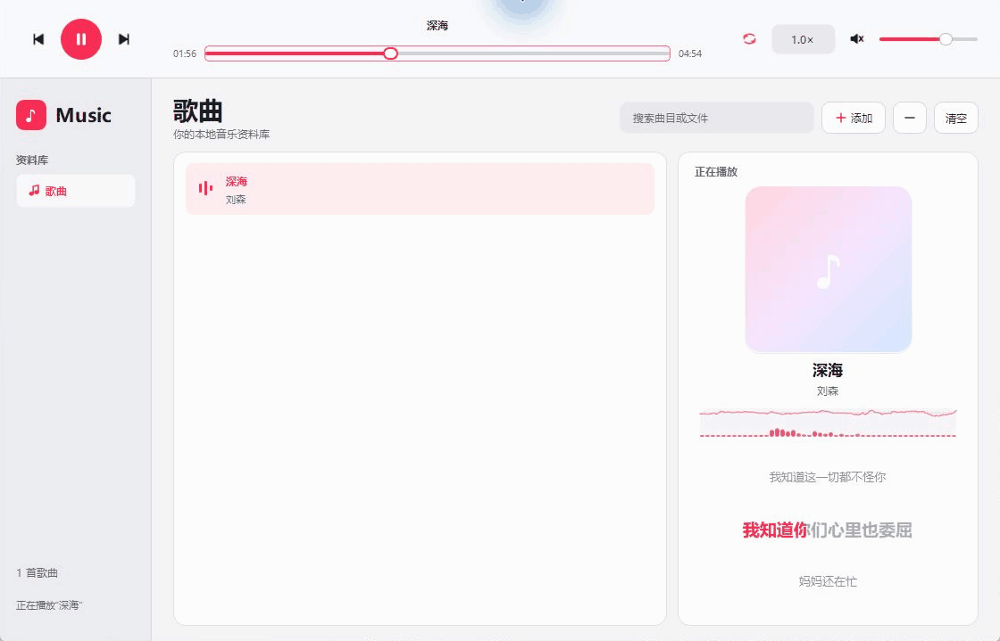
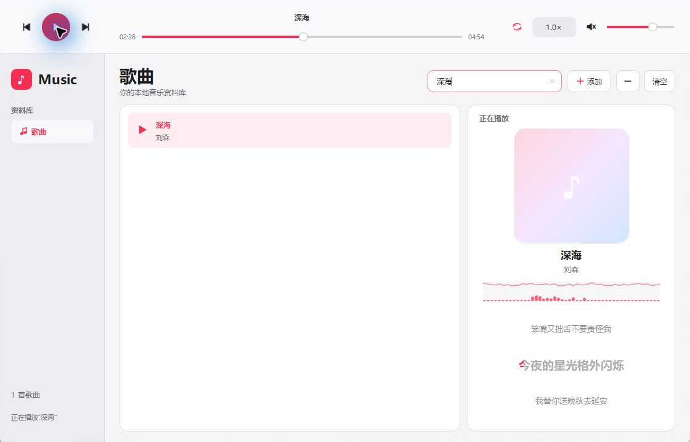

<div align="center">

# Qt 音乐播放器

**听见音乐，也看见它的节奏。**

本地音频播放 · LRC 歌词同步 · 实时波形与频谱


[](LICENSE)

[界面预览](#界面预览) · [功能](#功能) · [快速上手](#快速上手) · [构建与部署](#windows-构建与部署) · [English](#english)

</div>

基于 **Qt Widgets / C++17** 的桌面音乐播放器，将音乐资料库、歌词和音频可视化放在同一界面。可用于本地听歌，也可作为学习 Qt Multimedia、LRC 解析与实时 FFT 分析的代码示例。

## 界面预览

**播放演示** · 歌词随播放进度高亮，波形与频谱实时变化。



<details>
<summary>查看波形、频谱与歌词特写</summary>

放大查看正在播放的曲目信息、音频可视化与同步歌词。


</details>

<details>
<summary>查看音乐资料库与搜索筛选</summary>

浏览已导入的曲目，使用搜索框快速筛选。



</details>

> 动图录制自 Windows 上实际运行的播放器，仅包含播放器窗口。使用《深海》作为演示，音频及歌词文件不随仓库分发。

## 功能

| 功能 | 说明 |
| --- | --- |
| 音乐资料库 | 文件选择或拖入导入，自动跳过重复文件；搜索筛选、拖动排序、移除曲目、列表循环。 |
| 播放控制 | 上一首 / 下一首、进度拖动、音量与静音、**0.5–3.0 倍速**；读取歌曲元数据与内嵌专辑封面。 |
| 同步歌词 | 自动查找同目录同名 `.lrc`；支持多时间标签、时间偏移、UTF-8、带 BOM 的 UTF-16 与 GB18030。 |
| 波形与频谱 | 通过 `QAudioBufferOutput` 获取音频，使用**内置 radix-2 FFT** 分析；无需 KissFFT 或其他外部 FFT 库。 |
| 播放异常提示 | 显示播放错误，并在播放过程中尝试跳过无法播放的文件。 |

文件选择器支持 MP3、M4A、AAC、WAV、FLAC、OGG、OPUS 等扩展名；**实际解码能力取决于 Qt Multimedia 后端及所部署的编解码器**。歌词采用 LRC 行时间同步，当前行高亮随行内进度推进，不包含逐字时间标注。

## 快速上手

1. 点击添加按钮，或将音频文件拖入列表；双击曲目开始播放。
2. 将歌词放在音频旁并保持同名，例如 `song.flac` 与 `song.lrc`。
3. 使用搜索框筛选曲目，拖动列表条目调整顺序；从列表移除曲目不会删除磁盘文件。

### 快捷键

| 快捷键 | 操作 |
| --- | --- |
| `Ctrl+O` | 添加音频文件 |
| `Ctrl+F` | 聚焦搜索框 |
| `Ctrl+M` | 切换静音 |
| `Enter` | 播放选中曲目，需焦点位于列表 |
| `Space` | 播放 / 暂停（列表获得焦点时可用） |
| `Delete` / `Backspace` | 从列表移除选中曲目，需焦点位于列表 |

## Windows 构建与部署

### 环境要求

| 依赖 | 要求 |
| --- | --- |
| 系统与编译器 | Windows x64、Visual Studio 2022 C++ 工具链、Windows SDK |
| Qt | **6.8+**，使用 `msvc2022_64` 套件 |
| Qt 模块 | `Core`、`Core5Compat`、`Widgets`、`Multimedia`、`MultimediaWidgets`；测试另需 `Test` |
| 构建工具 | **CMake 3.21+**、Ninja，均可从 `PATH` 访问 |

`res.qrc` 引用的图片和应用图标已随源码提供，无需额外下载资源包或 FFT 库。

### 编译、测试与安装

打开 **x64 Native Tools Command Prompt for VS 2022（CMD）**，进入项目根目录。将 `C:\Qt\6.x.x\msvc2022_64` 替换为本机实际 Qt 套件路径：

```bat
set "QTDIR=C:\Qt\6.x.x\msvc2022_64"
set "PATH=%QTDIR%\bin;%PATH%"
cmake --preset qt-release
cmake --build --preset qt-release
ctest --preset qt-release
cmake --install build/qt-release --prefix dist
```

`qt-release` 预设使用 Ninja、Release 配置与 `QTDIR`，并开启测试；构建目录为 `build/qt-release`。安装命令将应用及 Qt 部署脚本收集的运行依赖写入 `dist`；运行 `dist/bin/audioplayer.exe`，分发时保留整个 `dist` 目录。

<details>
<summary>使用 PowerShell 或 Qt Creator</summary>

在**已初始化 MSVC x64 环境**的 PowerShell 中，将上述前两行替换为：

```powershell
$env:QTDIR = 'C:\Qt\6.x.x\msvc2022_64'
$env:PATH = "$env:QTDIR\bin;$env:PATH"
```

其余命令相同。也可在 Qt Creator 中打开 `CMakeLists.txt`，选择满足依赖的 MSVC x64 Kit，配置、构建并运行。

</details>

**构建验证：**Windows x64、Qt 6.11.2、MSVC 19.50、CMake 4.1.5、Ninja；全新 Release 构建成功，CTest **1/1** 通过，包含 **10 个功能测试用例**。测试覆盖歌词解析、编码、时间边界、歌词文件查找与反相立体声音频分析。

## 反馈与改进

遇到问题可提交 [Issue](https://github.com/heikamorry/karaokespectrum-wave-audioplayer-OK-hi-res-/issues)，附上 Qt 版本、音频格式、复现步骤和错误提示；欢迎讨论功能或提交改进。

## English

**Qt Audio Player** is a local desktop music player built with Qt Widgets and C++17. It combines a searchable music library, synchronized LRC lyrics, and real-time waveform and spectrum visualization.

- **Playback:** drag-and-drop import, duplicate filtering, queue reordering, repeat, seeking, volume, mute, and 0.5–3.0× speed; track metadata and embedded artwork.
- **Lyrics:** place a matching `.lrc` beside the audio file. Supports multiple timestamps, offsets, UTF-8, BOM-marked UTF-16, and GB18030. Karaoke-style highlighting uses **line timing**, without word-level timestamps.
- **Visualization:** audio from `QAudioBufferOutput` is analyzed with a built-in radix-2 FFT. **No KissFFT dependency.**
- **Formats:** the file picker accepts MP3, M4A, AAC, WAV, FLAC, OGG, OPUS, and more. Decoding depends on the Qt Multimedia backend and deployed codecs.

To build on Windows x64, use the VS 2022 C++ toolchain, Qt **6.8+** (`msvc2022_64`), CMake **3.21+**, and Ninja. Required Qt modules are `Core`, `Core5Compat`, `Widgets`, `Multimedia`, and `MultimediaWidgets`, plus `Test` for tests. In an initialized MSVC x64 shell, set `QTDIR` to your Qt kit directory and follow the commands above. Run the installed application from `dist/bin/audioplayer.exe`; keep the complete `dist` directory when distributing it.

GIFs are recorded from the player running on Windows and contain only the player window. “深海” is used for the demonstration; its audio and lyric files are not distributed with this repository.

## 许可证 · License

[MIT License](LICENSE)
